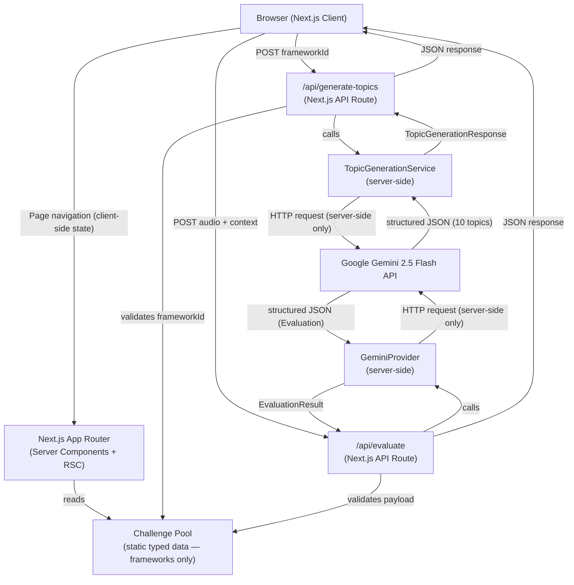

# Design Document — FluentUp MVP-0

## Overview

FluentUp MVP-0 is a stateless, single-session web application that puts a user through one complete communication training loop: select a framework by number → AI generates 10 fresh topics → select a topic by number → read the challenge details while a 15-second preparation timer auto-counts → record a 60-second spoken response → receive AI-generated structured feedback. No authentication, no database, no persistent state across sessions.

The application is built on Next.js (App Router) with TypeScript. All AI communication happens server-side through a provider-agnostic service layer. The browser handles audio capture only; topic generation, scoring, and evaluation are entirely server-side. The design is intentionally minimal: two pages, two API routes, and a static data layer for frameworks only. Topics are generated fresh by Gemini 2.5 Flash for every challenge.

---

## Architecture

### System Overview



### Request / Response Flows

**Framework Selection** — Purely client-side state transitions. The static Framework Pool is read at server startup; the browser shuffles the loaded frameworks into numbered slots using `assignSlots`.

**Topic Generation** — After the user confirms a Framework, the browser POSTs the `frameworkId` to `/api/generate-topics`. The server validates the framework ID, calls `TopicGenerationService`, which calls Gemini 2.5 Flash with the framework's details and requests exactly 10 diverse, framework-appropriate topics in structured JSON. The server validates and assigns sequential IDs, then returns the 10 `GeneratedTopic` objects. The browser assigns them to numbered slots 1–10.

**Topic Selection** — Purely client-side state transitions. The browser displays the numbered slots; the user selects a number and the topic text is revealed.

**AI Evaluation** — The browser encodes the recorded audio blob and POSTs it along with the framework ID and topic text to `/api/evaluate`. The API route validates the payload, looks up the framework from the Challenge Pool, builds the evaluation prompt, calls the GeminiProvider, and returns either a typed `Evaluation` object or a typed `EvaluationError`. Scores are never accepted from the client.

---

## Technology Decisions

| Concern | Choice | Rationale |
|---|---|---|
| Framework | Next.js 14 App Router | File-based routing, API routes, RSC support, Vercel-native |
| Language | TypeScript (strict) | End-to-end type safety for Evaluation schema and Challenge Pool |
| Styling | Tailwind CSS | Rapid UI iteration, no CSS-in-JS runtime cost |
| AI provider | Google Gemini 2.5 Flash | Native audio blob input in one call, generous free tier, structured JSON output, future Gemini Live path; used for both topic generation and evaluation |
| Audio format | WebM/Opus preferred, WAV fallback | Gemini accepts both; WebM/Opus is smaller and natively supported in Chrome/Firefox |
| State management | React Context + `useReducer` | Challenge flow is a linear state machine with ~8 phases; no external library needed |
| Deployment | Vercel | Zero-config Next.js deployment, edge-friendly API routes |
| Topic freshness | AI-generated per challenge via Gemini 2.5 Flash | Unlimited variety, always fresh, framework-contextual topics with no static list to maintain |

---

## Project Directory Structure

```
fluentup/
├── .env.example
├── .gitignore
├── next.config.ts
├── tsconfig.json
├── tailwind.config.ts
├── package.json
│
├── src/
│   ├── app/
│   │   ├── layout.tsx
│   │   ├── page.tsx
│   │   ├── challenge/
│   │   │   └── page.tsx
│   │   └── api/
│   │       ├── generate-topics/
│   │       │   └── route.ts        # POST /api/generate-topics
│   │       └── evaluate/
│   │           └── route.ts        # POST /api/evaluate
│   │
│   ├── components/
│   │   ├── phases/
│   │   │   ├── FrameworkSelection.tsx
│   │   │   ├── TopicSelection.tsx
│   │   │   ├── ChallengeScreen.tsx
│   │   │   ├── PreparationPhase.tsx
│   │   │   ├── RecordingPhase.tsx
│   │   │   └── FeedbackScreen.tsx
│   │   ├── ui/
│   │   │   ├── NumberedGrid.tsx
│   │   │   ├── CountdownTimer.tsx
│   │   │   ├── ScoreCard.tsx
│   │   │   ├── LoadingIndicator.tsx
│   │   │   └── ErrorMessage.tsx
│   │   └── layout/
│   │       └── ChallengeContext.tsx
│   │
│   ├── hooks/
│   │   ├── useCountdown.ts
│   │   ├── useAudioRecorder.ts
│   │   └── useChallengeFlow.ts
│   │
│   ├── lib/
│   │   ├── challenge-pool/
│   │   │   ├── frameworks.ts
│   │   │   └── index.ts
│   │   ├── ai/
│   │   │   ├── types.ts
│   │   │   ├── ai-service.ts
│   │   │   ├── topic-generation-service.ts
│   │   │   └── gemini-provider.ts
│   │   ├── random-selector.ts
│   │   └── validation.ts
│   │
│   └── types/
│       └── index.ts
```

Note: No `topics.ts` file exists. Topics come exclusively from AI generation.

---

## Components and Interfaces

### Phase Component Map

Each phase is a standalone React component that receives the current challenge state and a dispatch function from the `ChallengeFlowContext`. Components do not manage phase transitions directly — they dispatch actions and let the reducer advance the phase.

```
ChallengeFlowContext (useReducer)
│
├── Phase: FRAMEWORK_SELECTION  →  <FrameworkSelection />
├── Phase: GENERATING_TOPICS    →  <LoadingIndicator /> (with error/retry state)
├── Phase: TOPIC_SELECTION      →  <TopicSelection />
├── Phase: CHALLENGE_SCREEN     →  <ChallengeScreen />
├── Phase: PREPARATION          →  <PreparationPhase />
├── Phase: RECORDING            →  <RecordingPhase />
├── Phase: ANALYZING            →  <LoadingIndicator />
└── Phase: FEEDBACK             →  <FeedbackScreen />
```

### Key Component Contracts

**`<NumberedGrid>`**
```typescript
interface NumberedGridProps {
  count: number;               // 5–10 slots
  onSelect: (slot: number) => void;
  selectedSlot: number | null;
  revealedLabel: string | null; // null until selected
  disabled: boolean;
}
```

**`<CountdownTimer>`**
```typescript
interface CountdownTimerProps {
  totalSeconds: number;
  onComplete: () => void;
  running: boolean;  // display hint only — the underlying useCountdown hook auto-starts on mount
}
```

**`<RecordingPhase>`**
- Uses `useAudioRecorder` hook internally
- On mount, calls `startRecording()` automatically inside a `useEffect` (no user action required)
- Renders: recording indicator (pulsing icon + "Recording" label), 60-second countdown timer
- The `CountdownTimer` auto-starts (`running={true}`) and calls `stopRecording()` via `onComplete` when it reaches zero
- When `recState === 'stopped'` and `audioBlob` is available, dispatches `RECORDING_TIMER_COMPLETE` automatically — no Submit button, no short-recording check in the normal path
- Error states: mic denied (`state === 'error'`, denied message + browser instructions) and mid-recording disconnect (`state === 'error'`, disconnected message + re-record option)

**`<FeedbackScreen>`**
- Renders: overall score (prominent), category scores, strengths list, weaknesses list, framework-specific feedback, improvement suggestions, example stronger response, framework name + topic header, "Try Again" button
- On AI error: renders error message + "Retry Submission" button (no re-record required)

### Custom Hooks

**`useCountdown(totalSeconds, onComplete)`**
- Returns `{ remaining, running, skip, addTime }`
- Starts automatically on mount — no `running` prop required to begin counting
- `running` is a read-only output: `true` while the interval is active, `false` after completion or `skip()`
- `skip()` immediately calls `onComplete` and stops the timer
- `addTime(seconds)` adds the given number of seconds to the current remaining time; the interval continues running from the updated value without restarting from `totalSeconds`
- Backed by `setInterval` with cleanup on unmount; completion fires synchronously when the interval reaches zero (no nested `setTimeout`)

**`useAudioRecorder()`**
- Returns `{ state, startRecording, stopRecording, audioBlob, durationMs, error }`
- `state`: `'idle' | 'requesting' | 'recording' | 'stopped' | 'error'`
- Handles `getUserMedia`, `MediaRecorder`, `ondataavailable`, `onstop`
- Prefers `audio/webm;codecs=opus`, falls back to `audio/wav`
- Sets `mimeType` on the returned blob for API route content-type validation

**`useChallengeFlow()`**
- Wraps `useReducer` with the `ChallengeFlowState` and `ChallengeFlowAction` types
- Exposes `state`, `dispatch`, and convenience action creators
- On `CONFIRM_FRAMEWORK`: calls `/api/generate-topics`, dispatches `TOPICS_GENERATED` or `TOPIC_GENERATION_ERROR`
- `frameworkSlots` are generated client-side by shuffling the static Framework Pool using `assignSlots`
- `topicSlots` are populated from the `/api/generate-topics` API response, not from a static pool

**`<PreparationPhase>`**
- Consumes `useChallengeFlow` for state and dispatch
- Uses `useCountdown` directly (not `<CountdownTimer>`) so it can call `addTime()`, which is not exposed through the `CountdownTimer` component interface
- Timer auto-starts on mount — no user confirmation needed
- "+15s Preparation" button calls `addTime(15)` on the hook and dispatches `ADD_PREPARATION_TIME` (no-op in reducer; kept for action-log completeness)
- "Skip Preparation" button calls `skip()` which immediately fires `onComplete` → dispatches `PREP_COMPLETE`
- Displays framework name, structural steps, and topic throughout

---

## Data Models

### Core Types (`src/types/index.ts`)

```typescript
// ── Challenge Pool types ──────────────────────────────────────────────────────

export interface EvaluationCriterion {
  id: string;                     // e.g., "prep_point"
  label: string;                  // e.g., "Clear Point"
  description: string;            // 1–200 chars; injected into AI prompt
}

export interface Framework {
  id: string;                     // unique, 1–50 chars, e.g., "prep"
  name: string;                   // display name, 1–100 chars
  description: string;            // 1–500 chars
  structuralSteps: string[];      // ordered steps shown on Challenge Screen
  evaluationCriteria: EvaluationCriterion[]; // 1–10 items; drives AI prompt
  preparationTimeSeconds: number; // MVP-0: 15
  speakingTimeSeconds: number;    // MVP-0: 60
}

export interface Topic {
  id: string;                     // unique identifier
  text: string;                   // the prompt shown to the user
}

// ── AI-generated topic types ──────────────────────────────────────────────────

export interface GeneratedTopic {
  id: string;       // server-assigned, e.g., "generated-1"
  text: string;     // the topic prompt shown to the user after selection
}

export interface TopicGenerationRequest {
  frameworkId: string;
  frameworkName: string;
  frameworkDescription: string;
  structuralSteps: string[];
  evaluationCriteria: EvaluationCriterion[];
}

export interface TopicGenerationResult {
  topics: GeneratedTopic[];  // always exactly 10
}

export type TopicGenerationError = {
  type: 'TIMEOUT' | 'SCHEMA_MISMATCH' | 'PROVIDER_ERROR' | 'VALIDATION_ERROR' | 'INSUFFICIENT_TOPICS' | 'DUPLICATE_TOPICS';
  message: string;
};

export type TopicGenerationResponse =
  | { success: true; result: TopicGenerationResult }
  | { success: false; error: TopicGenerationError };

// ── Session / flow types ──────────────────────────────────────────────────────

export interface NumberedSlot<T> {
  slot: number;                   // 1-based display number
  item: T;                        // hidden until selected
}

export type FrameworkSlot = NumberedSlot<Framework>;
export type TopicSlot = NumberedSlot<GeneratedTopic>;

export interface ChallengeContext {
  framework: Framework;
  topic: GeneratedTopic;
}

// ── Evaluation schema ─────────────────────────────────────────────────────────

export interface CategoryScore {
  criterionId: string;            // matches EvaluationCriterion.id
  label: string;                  // human-readable category name
  score: number;                  // 0–100, server-computed
}

export interface Evaluation {
  overallScore: number;           // 0–100, server-computed
  categoryScores: CategoryScore[];
  strengths: string[];            // 1–5 items, 10–200 chars each
  weaknesses: string[];           // 1–5 items, 10–200 chars each
  frameworkFeedback: string;      // 50–500 chars, framework-specific
  suggestions: string[];          // 1–3 items, 20–300 chars each
  exampleResponse: string;        // 50–500 chars
}

export interface EvaluationError {
  type: 'TIMEOUT' | 'SCHEMA_MISMATCH' | 'PROVIDER_ERROR' | 'VALIDATION_ERROR';
  message: string;                // human-readable, no internal details
}

export type EvaluationResult = 
  | { success: true; evaluation: Evaluation }
  | { success: false; error: EvaluationError };

// ── Client-side challenge flow state machine ──────────────────────────────────

export type ChallengePhase =
  | 'FRAMEWORK_SELECTION'
  | 'GENERATING_TOPICS'
  | 'TOPIC_SELECTION'
  | 'CHALLENGE_SCREEN'
  | 'PREPARATION'
  | 'RECORDING'
  | 'ANALYZING'
  | 'FEEDBACK';

export interface ChallengeFlowState {
  phase: ChallengePhase;
  frameworkSlots: FrameworkSlot[];         // shuffled client-side from static Framework Pool
  topicSlots: TopicSlot[];                 // populated from /api/generate-topics response
  selectedFramework: Framework | null;
  selectedTopic: GeneratedTopic | null;
  audioBlob: Blob | null;
  evaluationResult: EvaluationResult | null;
  topicGenerationError: TopicGenerationError | null;
  phaseError: string | null;               // per-phase recoverable error
}

export type ChallengeFlowAction =
  | { type: 'SELECT_FRAMEWORK'; framework: Framework }
  | { type: 'CONFIRM_FRAMEWORK' }
  | { type: 'TOPICS_GENERATED'; topicSlots: TopicSlot[] }
  | { type: 'TOPIC_GENERATION_ERROR'; error: TopicGenerationError }
  | { type: 'RETRY_TOPIC_GENERATION' }
  | { type: 'SELECT_TOPIC'; topic: GeneratedTopic }
  | { type: 'CONFIRM_TOPIC' }
  | { type: 'PREP_COMPLETE' }
  | { type: 'SKIP_PREP' }
  /**
   * No-op in the reducer. The "+15s Preparation" button calls addTime(15) on
   * the useCountdown hook directly; the remaining time lives in hook state, not
   * in the reducer. This action is included so the state machine remains the
   * authoritative record of all dispatched actions.
   */
  | { type: 'ADD_PREPARATION_TIME' }
  | { type: 'RECORDING_COMPLETE'; audioBlob: Blob }
  | { type: 'SUBMIT_FOR_ANALYSIS' }
  /**
   * Fired automatically by RecordingPhase when the 60-second timer expires.
   * Stores the completed audio blob and transitions directly to ANALYZING in a
   * single atomic state update — no separate SUBMIT_FOR_ANALYSIS dispatch
   * needed in the normal recording flow.
   */
  | { type: 'RECORDING_TIMER_COMPLETE'; audioBlob: Blob }
  | { type: 'ANALYSIS_SUCCESS'; evaluation: Evaluation }
  | { type: 'ANALYSIS_ERROR'; error: EvaluationError }
  | { type: 'RETRY_SUBMISSION' }
  | { type: 'RE_RECORD' }
  | { type: 'START_NEW_CHALLENGE' };
```

### Challenge Pool Data (`src/lib/challenge-pool/`)

**`frameworks.ts`** — defines at minimum:

```typescript
export const FRAMEWORKS: Framework[] = [
  {
    id: 'prep',
    name: 'PREP',
    description: 'A four-step framework: make a Point, give a Reason, provide an Example, restate the Point.',
    structuralSteps: [
      '1. State your Point clearly',
      '2. Give a Reason that supports it',
      '3. Provide an Example to illustrate',
      '4. Restate the Point to close',
    ],
    evaluationCriteria: [
      { id: 'prep_point',   label: 'Clear Point',         description: 'Opens with a clear, direct statement of position or main idea.' },
      { id: 'prep_reason',  label: 'Supporting Reason',   description: 'Provides a logical reason that directly supports the point.' },
      { id: 'prep_example', label: 'Concrete Example',    description: 'Gives a specific, relevant example that illustrates the reason.' },
      { id: 'prep_restate', label: 'Point Restatement',   description: 'Closes by restating or reinforcing the original point.' },
      { id: 'relevance',    label: 'Topic Relevance',     description: 'Response stays on topic throughout.' },
      { id: 'clarity',      label: 'Clarity & Structure', description: 'Language is clear, sentences are well-formed, delivery feels structured.' },
    ],
    preparationTimeSeconds: 15,
    speakingTimeSeconds: 60,
  },
  {
    id: 'what_so_what_now_what',
    name: 'What–So What–Now What',
    description: 'A three-part reflective framework: describe What happened, explain So What it means, state Now What should be done.',
    structuralSteps: [
      '1. What — describe the situation or event',
      '2. So What — explain its significance or impact',
      '3. Now What — state the next action or takeaway',
    ],
    evaluationCriteria: [
      { id: 'wsnw_what',     label: 'What (Situation)',   description: 'Clearly describes the situation, event, or observation.' },
      { id: 'wsnw_sowhat',   label: 'So What (Meaning)',  description: 'Explains why it matters or what impact it has.' },
      { id: 'wsnw_nowwhat',  label: 'Now What (Action)',  description: 'States a concrete next step, recommendation, or takeaway.' },
      { id: 'relevance',     label: 'Topic Relevance',    description: 'Response stays on topic throughout.' },
      { id: 'clarity',       label: 'Clarity & Structure', description: 'Language is clear and the three parts are distinguishable.' },
    ],
    preparationTimeSeconds: 15,
    speakingTimeSeconds: 60,
  },
  // Additional frameworks follow the same shape
];
```

**`index.ts`** — validates the pool at module load time and logs errors for any framework missing required fields, excluding it from the active pool (Requirement 10.7).

---

## AI Service Abstraction Design

There are two distinct AI service responsibilities in MVP-0:

### A. TopicGenerationService (`src/lib/ai/topic-generation-service.ts`)

- Takes a `TopicGenerationRequest` (framework name, description, structural steps, evaluation criteria)
- Calls Gemini 2.5 Flash with a prompt requesting exactly 10 diverse, framework-appropriate topics
- Requests structured JSON response: `{ "topics": [{ "text": "..." }, ...] }`
- Validates response: exactly 10 topics, non-empty text, no duplicate text values (case-insensitive)
- Assigns sequential server-side IDs: `generated-1` through `generated-10`
- Returns `TopicGenerationResponse`
- Enforces 30-second timeout
- Wraps errors as `TopicGenerationError`

### B. GeminiProvider for Evaluation (`src/lib/ai/gemini-provider.ts`)

- Takes an `AIEvaluationRequest` (audio buffer + framework details + topicText)
- Sends audio (base64-encoded) inline with the evaluation prompt to Gemini 2.5 Flash in a single API call
- `response_mime_type: 'application/json'` enforces structured output
- Reads `AI_API_KEY`, `AI_MODEL` from `process.env`
- Constructs prompt from `evaluationCriteria` array (no hardcoded framework logic)
- Parses and validates response against `Evaluation` schema; returns `EvaluationError` on schema mismatch (Req 6.8)
- Wraps network errors as `{ type: 'PROVIDER_ERROR' }` (Req 6.7)
- Enforces 30-second request timeout (Req 7.7)

**Evaluation prompt strategy:**
```
System: You are an expert communication coach evaluating a spoken response.
        You MUST return valid JSON matching this schema: { overallScore, categoryScores, 
        strengths, weaknesses, frameworkFeedback, suggestions, exampleResponse }

User:   Framework: {name}
        Topic: "{topicText}"
        
        Evaluate the response against these criteria:
        {criteria.map(c => `- ${c.label}: ${c.description}`).join('\n')}
        
        [Audio inline as base64]
```

### Interface and Factory (`src/lib/ai/ai-service.ts`)

```typescript
// src/lib/ai/types.ts

export interface AIEvaluationRequest {
  audioBlob: Buffer;             // raw audio bytes (server-side Buffer)
  audioMimeType: string;         // 'audio/webm;codecs=opus' | 'audio/wav'
  frameworkId: string;
  frameworkName: string;
  evaluationCriteria: EvaluationCriterion[];
  topicText: string;
}

export interface AIProvider {
  readonly id: string;           // e.g., 'gemini'
  evaluate(request: AIEvaluationRequest): Promise<EvaluationResult>;
}
```

```typescript
// src/lib/ai/ai-service.ts

export function createAIProvider(): AIProvider {
  // MVP-0: Gemini is the only provider.
  // Future: read AI_PROVIDER env var and return appropriate implementation.
  return new GeminiProvider();
}
```

---

## API Route Design

### `POST /api/generate-topics`

**Request body (JSON):**
```json
{ "frameworkId": "prep" }
```

**Validation:**
1. `frameworkId` present and non-empty
2. `frameworkId` exists in Framework Pool

On validation failure: HTTP 400 with `{ error: string }`

**Response (success):** HTTP 200
```json
{
  "success": true,
  "result": {
    "topics": [
      { "id": "generated-1", "text": "Should social media platforms be regulated by governments?" },
      { "id": "generated-2", "text": "..." },
      ...
    ]
  }
}
```

**Response (AI error):** HTTP 200
```json
{
  "success": false,
  "error": { "type": "INSUFFICIENT_TOPICS", "message": "Topic generation returned fewer than 10 topics. Please try again." }
}
```

**Response (validation error):** HTTP 400
```json
{ "error": "Framework ID not found." }
```

---

### `POST /api/evaluate`

**Request** (`multipart/form-data`):

| Field | Type | Constraints |
|---|---|---|
| `audio` | File/Blob | `content-type: audio/*`, max 25 MB |
| `frameworkId` | string | Must exist in Challenge Pool |
| `topicText` | string | Max 500 chars, must be non-empty |

**Validation sequence (all server-side):**
1. Check `audio` field present and `content-type` starts with `audio/`
2. Check audio size ≤ 25 MB
3. Look up `frameworkId` in Challenge Pool — reject if not found
4. Validate `topicText` present and non-empty

Validation failures return HTTP 400 with `{ error: string }` — no internal details, no AI call made.

**Response (success):** HTTP 200
```json
{
  "success": true,
  "evaluation": {
    "overallScore": 82,
    "categoryScores": [
      { "criterionId": "prep_point", "label": "Clear Point", "score": 90 }
    ],
    "strengths": ["..."],
    "weaknesses": ["..."],
    "frameworkFeedback": "...",
    "suggestions": ["..."],
    "exampleResponse": "..."
  }
}
```

**Response (AI error):** HTTP 200 (not 5xx — client handles retry)
```json
{
  "success": false,
  "error": {
    "type": "TIMEOUT",
    "message": "The AI service took too long to respond. Please try again."
  }
}
```

**Response (validation error):** HTTP 400
```json
{ "error": "Audio payload exceeds the 25 MB size limit." }
```

---

## Client-Side State Management

The entire challenge flow is managed by a single `useReducer` inside `ChallengeFlowContext`. The context is provided at the `/challenge` route level and does not persist across page navigations.

### State Machine

```
FRAMEWORK_SELECTION
  → SELECT_FRAMEWORK (reveals name, enables proceed)
  → CONFIRM_FRAMEWORK → GENERATING_TOPICS
GENERATING_TOPICS                   ← browser calls /api/generate-topics
  → TOPICS_GENERATED (stores topicSlots) → TOPIC_SELECTION
  → TOPIC_GENERATION_ERROR → (retry available, stays in GENERATING_TOPICS)
TOPIC_SELECTION
  → SELECT_TOPIC (reveals text, enables proceed)
  → CONFIRM_TOPIC → CHALLENGE_SCREEN
CHALLENGE_SCREEN                    ← renders challenge details; prep timer starts automatically
PREPARATION
  → ADD_PREPARATION_TIME (no-op in reducer; addTime(15) handled by useCountdown)
  → PREP_COMPLETE / SKIP_PREP → RECORDING
RECORDING                           ← recording starts automatically on mount; timer auto-starts
  → RECORDING_TIMER_COMPLETE (stores audioBlob atomically) → ANALYZING
ANALYZING                           ← browser calls /api/evaluate with stored audioBlob
  → ANALYSIS_SUCCESS → FEEDBACK
  → ANALYSIS_ERROR   → FEEDBACK (with error state)
FEEDBACK
  → START_NEW_CHALLENGE → FRAMEWORK_SELECTION (new shuffled framework slots; topics will be regenerated)
  → RETRY_SUBMISSION    → ANALYZING (re-uses existing audioBlob)
  → RE_RECORD           → RECORDING (resets audioBlob, full timer)
```

> **Note on normal recording flow:** `RECORDING_COMPLETE` and `SUBMIT_FOR_ANALYSIS` are still defined action types for completeness (e.g. future manual-stop paths), but in the standard MVP-0 flow only `RECORDING_TIMER_COMPLETE` is dispatched — it stores the blob and advances to `ANALYZING` in a single reducer case.

The shuffled `frameworkSlots` are generated client-side once per session (or on `START_NEW_CHALLENGE`) by calling `assignSlots` on the static Framework Pool. The `topicSlots` are populated from the `/api/generate-topics` response after the user confirms a Framework.

```typescript
// src/lib/random-selector.ts
export function assignSlots<T>(items: T[]): NumberedSlot<T>[] {
  const shuffled = [...items].sort(() => Math.random() - 0.5);
  return shuffled.map((item, i) => ({ slot: i + 1, item }));
}
```

The context strip (`ChallengeContext.tsx`) reads `selectedFramework` and `selectedTopic` from context and renders them as a persistent header once both are set, satisfying Requirement 11.5.

---

## Audio Recording Approach

All audio capture uses the browser's native `MediaRecorder` API inside the `useAudioRecorder` hook.

### Format Selection

```typescript
function selectMimeType(): string {
  const preferred = [
    'audio/webm;codecs=opus',
    'audio/webm',
    'audio/ogg;codecs=opus',
    'audio/wav',
  ];
  return preferred.find(t => MediaRecorder.isTypeSupported(t)) ?? '';
}
```

### Recording Lifecycle

1. `startRecording()` — calls `navigator.mediaDevices.getUserMedia({ audio: true })`
   - On denial → sets `state = 'error'`, surfaces microphone-required message (Req 5.2)
2. Creates `MediaRecorder` with chosen MIME type, `ondataavailable` pushes chunks
3. `stopRecording()` — calls `mediaRecorder.stop()`, `onstop` assembles `Blob` from chunks
4. Duration is tracked from `start` timestamp to `stop` timestamp
5. On `onerror` or `ondataavailable` with empty data mid-recording → sets `state = 'error'` (Req 5.12)

**Auto-submit flow (normal path):**
- `RecordingPhase` mounts → `startRecording()` called in `useEffect([], [])` — recording begins immediately
- `CountdownTimer` auto-starts (`running={true}`) → at 60 seconds, fires `onComplete` → calls `stopRecording()`
- A `useEffect` watches `recState === 'stopped' && audioBlob !== null` → dispatches `RECORDING_TIMER_COMPLETE` once, atomically storing the blob and advancing to `ANALYZING`
- No stop button, no submit button, no short-recording warning are shown in the normal flow

The assembled `Blob` is sent to the API route as `multipart/form-data`. The `type` property of the blob is the selected MIME type, which the API route validates against `audio/*`.

---

## Challenge Data Design

### Framework Pool

Defined in `src/lib/challenge-pool/frameworks.ts` as a TypeScript constant array. Validated at module import time by `index.ts`. The validation checks all required fields (id, name, description, structuralSteps, evaluationCriteria, times) and logs errors + excludes malformed entries (Req 10.7). MVP-0 ships with at minimum PREP and What-So-What-Now-What.

### Topic Generation Strategy

Topics are generated on-demand by Gemini 2.5 Flash. Each time a user confirms a Framework selection, the application calls `POST /api/generate-topics`. The `TopicGenerationService` sends the selected Framework's details (name, description, structural steps, evaluation criteria) to Gemini and requests exactly 10 diverse, framework-appropriate topics in structured JSON format. The server validates the response (exactly 10 topics, no duplicates, non-empty text within reasonable length), assigns sequential IDs (`generated-1` through `generated-10`), and returns the validated set to the browser. The browser assigns them to numbered slots 1–10 using `assignSlots`. When a new challenge starts, the process repeats — there is no static topic cache.

---

## Error Handling

### Per-Phase Error Recovery (Requirement 11.8)

Every phase component renders an `<ErrorMessage>` with a retry action when `phaseError` or `topicGenerationError` is non-null in the flow state. The error message identifies which phase failed. The retry action dispatches a phase-specific retry action without navigating back to Framework Selection.

| Phase | Error scenario | Recovery action |
|---|---|---|
| GENERATING_TOPICS | Gemini request fails | Show error + "Retry" button; stays in GENERATING_TOPICS |
| GENERATING_TOPICS | Gemini times out (30s) | Show timeout error + "Retry" button |
| GENERATING_TOPICS | Response has < 10 topics | Show error + "Retry" button |
| GENERATING_TOPICS | Response has > 10 topics | Truncate to first 10 and proceed |
| GENERATING_TOPICS | Duplicate topics in response | Show error + "Retry" button |
| GENERATING_TOPICS | Topics fail text validation | Show error + "Retry" button |
| CHALLENGE_SCREEN | Challenge context missing | Navigate to Topic Selection |
| RECORDING | Mic permission denied | Show instructions + re-record option |
| RECORDING | Mic disconnected during recording | Offer re-record (timer reset) |
| ANALYZING | AI timeout | Retry submission (same blob) |
| ANALYZING | AI schema mismatch | Retry submission |
| ANALYZING | Validation error (client) | Show validation message |

### API Route Error Handling

- **Validation failures** — HTTP 400, `{ error: string }` with user-facing message, no stack traces
- **AI provider errors** — HTTP 200, `{ success: false, error: EvaluationError | TopicGenerationError }` — the client treats this as a recoverable failure, not a network error
- **Unexpected server errors** — HTTP 500, `{ error: "An unexpected error occurred." }` — no internal details

### Unhandled Boundaries

A React error boundary wraps the `/challenge` page. If an uncaught render error escapes, the boundary renders a full-page error with a "Start Over" link to `/`.

---

## Environment Configuration

### `.env.example`
```dotenv
# AI Provider — currently only 'gemini' is supported in MVP-0
AI_PROVIDER=gemini

# API key for the Gemini API (Google AI Studio or Google Cloud)
AI_API_KEY=your_api_key_here

# Gemini model identifier
AI_MODEL=gemini-2.5-flash

# Optional: request timeout in milliseconds (default: 30000)
AI_TIMEOUT_MS=30000
```

- `.env.local` (real secrets) is listed in `.gitignore` and never committed
- All `process.env` access is server-side only (API route + AI service modules)
- No `NEXT_PUBLIC_` prefix on any AI variable — guarantees no client bundle inclusion

---

## Correctness Properties

*A property is a characteristic or behavior that should hold true across all valid executions of a system — essentially, a formal statement about what the system should do. Properties serve as the bridge between human-readable specifications and machine-verifiable correctness guarantees.*

### Property 1: Slot shuffling produces a valid, complete assignment

*For any* non-empty list of items (Frameworks or Topics) passed to `assignSlots`, the returned slot array SHALL contain exactly the same items as the input (no additions, no omissions), each assigned to a unique slot number in the range 1..N where N is the input length, with no two items sharing the same slot number.

**Validates: Requirements 1.3, 1.5, 1.7, 2.1, 2.5**

---

### Property 2: Topic generation validation enforces exactly 10 distinct topics

For any topic-generation request, the TopicGenerationService SHALL return exactly 10 valid, distinct topics on the success path. If the AI returns more than 10 valid topics, the service SHALL use the first 10. If fewer than 10 valid topics are returned, or if the response contains duplicates or invalid topics, the service SHALL retry topic generation. If topic generation continues to fail after the configured retry limit, the service SHALL return a structured error and allow th

**Validates: Requirements 2.1, 2.4, 2.5, 6.6, 6.7**

---

### Property 3: Evaluation output satisfies schema constraints

*For any* valid `AIEvaluationRequest` processed by the AI Service (with a mock provider returning varied data), the result on the success path SHALL be a well-formed `Evaluation` object where: all required top-level fields are present, `overallScore` is a number, all `categoryScores` entries contain a `score` field, `strengths` has 1–5 elements, `weaknesses` has 1–5 elements, `suggestions` has 1–3 elements, and `frameworkFeedback` and `exampleResponse` are non-empty strings. Serializing then deserializing the object SHALL produce a structurally equivalent value.

**Validates: Requirements 6.2, 7.4, 6.8**

---

### Property 4: Server-side score bounds are always in range

*For any* `Evaluation` object returned by the AI Service, the `overallScore` and every `categoryScore.score` value SHALL be a number in the closed interval [0, 100].

**Validates: Requirements 7.4, 7.5**

---

### Property 5: AI prompt is fully derived from Framework criteria with no hardcoded framework names

*For any* Framework entry in the active Challenge Pool, the evaluation prompt string constructed by the AI Service SHALL contain every string in that Framework's `evaluationCriteria[i].description` array, and the AI Service code SHALL NOT branch on a hardcoded framework name (such as "PREP") to construct that prompt.

**Validates: Requirements 7.8, 10.3**

---

### Property 6: API route rejects oversized or absent audio before calling AI

*For any* request to `POST /api/evaluate` where the audio payload is absent, has a content-type that does not start with `audio/`, or has a byte size exceeding 25 MB (26,214,400 bytes), the route SHALL return HTTP 400 with a user-facing error message and SHALL NOT invoke the AI Service.

**Validates: Requirements 9.3, 9.5, 9.8**

---

### Property 7: API route rejects unknown framework IDs before calling AI

*For any* request to `POST /api/evaluate` where the `frameworkId` value is a string that does not match any `id` field in the active Challenge Pool, the route SHALL return HTTP 400 and SHALL NOT invoke the AI Service.

**Validates: Requirements 9.4, 9.5**

---

### Property 8: Challenge flow reducer only produces valid phase values

*For any* `ChallengeFlowState` and any sequence of `ChallengeFlowAction` values applied through the reducer, every resulting state's `phase` field SHALL be one of the eight defined `ChallengePhase` literals (`FRAMEWORK_SELECTION`, `GENERATING_TOPICS`, `TOPIC_SELECTION`, `CHALLENGE_SCREEN`, `PREPARATION`, `RECORDING`, `ANALYZING`, `FEEDBACK`). The reducer SHALL never produce a `phase` value outside this set.

**Validates: Requirements 11.1, 11.8**

---

### Property 9: Short recording always surfaces a warning

*For any* completed audio recording whose duration is strictly less than 3000 milliseconds, the `useAudioRecorder` hook SHALL expose `shortRecordingWarning = true` in its returned state, regardless of the audio content or MIME type.

**Validates: Requirements 5.11**

---

### Property 10: AI Service never exposes raw provider error details to callers

*For any* error response (HTTP error, network failure, or malformed JSON) returned by the AI Provider, the `EvaluationError` object returned by the AI Service SHALL not contain any provider-specific string from the raw error body (such as API key fragments, provider endpoint URLs, or raw HTTP status text). The `message` field SHALL be a generic, user-facing string.

**Validates: Requirements 6.7, 9.7**

---

### Property 11: Challenge Pool startup validation excludes all malformed entries

*For any* array of Framework definitions where one or more entries are missing a required field (`id`, `name`, `description`, `structuralSteps`, `evaluationCriteria`, `preparationTimeSeconds`, or `speakingTimeSeconds`), the validated active pool produced at startup SHALL contain only the entries where all required fields are present and non-empty.

**Validates: Requirements 10.7**

---

## Testing Strategy

### Unit Tests (example-based)

- Challenge Pool validator: correct rejection of frameworks with missing required fields
- `assignSlots`: deterministic output length, no duplicate slot numbers, all input items present
- `TopicGenerationService` response validation: exactly 10 topics required, duplicate rejection, empty-text rejection, text length limits
- Evaluation schema validator: accepts valid objects, rejects out-of-range scores and missing fields
- API route validation helpers: each validation rule in isolation
- `useCountdown`: timer decrement, `skip()` early completion, cleanup on unmount
- `useChallengeFlow` reducer: every action → expected state transition
- `/api/generate-topics` route: valid frameworkId → 200 with 10 topics; invalid frameworkId → 400; AI failure → 200 with error

### Property-Based Tests

Use [fast-check](https://github.com/dubzzz/fast-check) (TypeScript-native PBT library).

Each property test runs a minimum of **100 iterations**. Tag format: `// Feature: fluentup-mvp, Property {N}: {property_text}`

| Property | Test approach |
|---|---|
| P1: Slot shuffling completeness | Generate arbitrary item arrays (1–10 items); assert returned slot set contains same items, unique slot numbers 1..N |
| P2: Topic generation validation rejects non-conforming responses | Generate AI response bodies with varying topic counts (0–20) and duplicate topics; assert `TopicGenerationService` returns error for count ≠ 10 or any duplicates |
| P3: Evaluation schema constraints | Generate varied mock provider responses; assert success path output passes full schema validation and survives JSON round-trip |
| P4: Score bounds | Generate Evaluation objects with varied numeric fields; assert overallScore and all categoryScore.score values are in [0, 100] |
| P5: Prompt derivation from criteria | Generate arbitrary Framework entries with varied criteria; assert each criterion description appears in constructed prompt |
| P6: Oversized/absent audio rejection | Generate byte arrays of sizes spanning the 25 MB boundary; assert HTTP 400 and no AI call above limit |
| P7: Unknown framework ID rejection | Generate arbitrary strings not in the active pool as frameworkId; assert HTTP 400 and no AI call |
| P8: State machine phase validity | Generate arbitrary action sequences against varied initial states; assert resulting phase is always one of the eight valid `ChallengePhase` literals (including `GENERATING_TOPICS`) |
| P9: Short recording warning | Generate recording durations in range [0, 2999ms]; assert shortRecordingWarning = true for all |
| P10: AI error isolation | Generate varied provider error bodies (HTTP errors, malformed JSON); assert EvaluationError.message contains no provider-sourced strings |
| P11: Pool startup validation | Generate Framework arrays with arbitrary missing fields; assert validated pool excludes all entries with missing required fields |

### Integration Tests

- Full `/api/evaluate` route with mock AI provider: valid payload → 200 with Evaluation; invalid payload → 400
- Full `/api/generate-topics` route with mock AI provider: valid frameworkId → 200 with 10 topics; invalid frameworkId → 400
- GeminiProvider (with mocked HTTP): correct prompt structure, base64 audio encoding, timeout handling
- `TopicGenerationService` with mocked Gemini: correct prompt includes framework name, description, structural steps, and evaluation criteria
- Challenge Pool module: startup validation logs errors for malformed entries, excludes them from active pool

### Testing Notes

- PBT is not used for UI rendering, MediaRecorder interactions, or timer visual updates — those use example-based unit tests or manual testing
- The AI Provider HTTP calls are mocked for all unit and property tests; integration tests use a dedicated test API key or a recorded response fixture
- Audio recording is tested via `jsdom` + mock `MediaRecorder` (example-based only — recording behavior doesn't vary meaningfully with PBT input variation)
